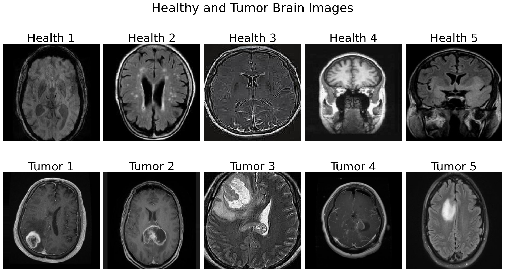
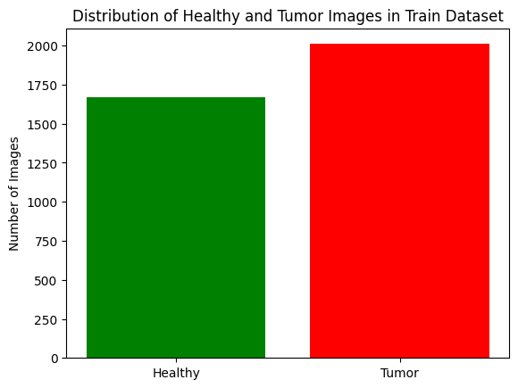
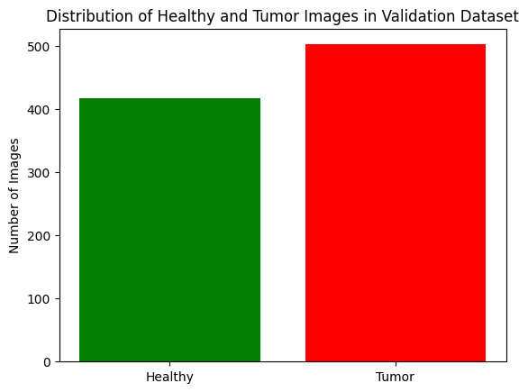

# Brain Tumor Classification Using Deep Learning

This repository contains the implementation of the term project for the course BIM453: Introduction to Machine Learning (2024-2025 Fall Semester). The goal of this project is to classify brain tumors from X-ray images into two categories: **Healthy** and **Tumor** using various deep learning techniques.

## Project Overview

Brain tumor classification is critical in the medical field as timely and accurate diagnosis plays a significant role in treatment. This project explores the potential of deep learning in medical imaging by training and evaluating multiple models, including custom-designed convolutional neural networks (CNNs) and pre-trained architectures (ResNet50, MobileNetV2, and DenseNet121).

### Key Features
- **Custom and Pre-trained Models**: Implementation of two custom CNN architectures and three pre-trained models using transfer learning.
- **Image Preprocessing**: Techniques like histogram equalization, data augmentation, and normalization.
- **Evaluation Metrics**: Models are compared using metrics such as Accuracy, Precision, Recall, and F1-Score.

## Dataset

The dataset consists of X-ray images divided into two categories: **Healthy** and **Tumor**. The dataset was balanced to avoid bias in model predictions. Below are example images and the distribution of the dataset:

### Example Images:


### Training Data Distribution:


### Validation Data Distribution:


## Methodology

### Image Preprocessing
Before training the models, the dataset was preprocessed with the following techniques:
- **Normalization**
- **Data Augmentation**
- **Histogram Equalization**

### Models Implemented
1. **Basic CNN 1**: A simple architecture with three convolutional layers, followed by max pooling and fully connected layers.
2. **Basic CNN 2**: Enhanced version of CNN 1 with Batch Normalization and Dropout layers.
3. **ResNet50**: Pre-trained on ImageNet, fine-tuned for binary classification.
4. **MobileNetV2**: Lightweight and computationally efficient model, also fine-tuned for binary classification.
5. **DenseNet121**: Utilizes dense connections for feature reuse, fine-tuned for the task.

### Implementation Details
- **Frameworks**: TensorFlow and Keras
- **Optimizer**: Adam with binary cross-entropy loss
- **Platform**: Google Colab with NVIDIA Tesla T4 GPUs

## Results
The performance of the models was evaluated using Accuracy, Precision, Recall, and F1-Score. The results are summarized below:

| Model          | Accuracy | Precision | Recall | F1 Score |
|----------------|----------|-----------|--------|----------|
| Basic CNN 1    | 95%      | 95%       | 95%    | 95%      |
| Basic CNN 2    | 87%      | 87%       | 86%    | 87%      |
| ResNet50       | 92%      | 93%       | 93%    | 93%      |
| MobileNetV2    | 91%      | 93%       | 91%    | 92%      |
| DenseNet121    | 92%      | 93%       | 91%    | 92%      |

### Training and Validation Graphs
#### Basic CNN 1:


#### ResNet50:


### Confusion Matrices
#### Basic CNN 1:


#### DenseNet121:


## Code Structure

```
├── data/
│   ├── raw/               # Original X-ray images
│   ├── processed/         # Preprocessed images
├── src/
│   ├── data_loading.py    # Data preprocessing functions
│   ├── model.py           # Model architectures
│   ├── visualization.py   # Visualization utilities
│   ├── utils.py           # Helper functions
├── notebooks/
│   ├── exploratory_data_analysis.ipynb
│   ├── modelling.ipynb
│   ├── inference.ipynb
├── experiments/           # Experimental results
├── models/                # Trained model weights
├── results/               # Visualizations of metrics
├── requirements.txt       # Dependencies
```

## Getting Started

### Prerequisites
Install the required dependencies using the following command:
```bash
pip install -r requirements.txt
```

### Running the Project
1. Clone the repository:
   ```bash
   git clone https://github.com/username/brain-tumor-classification.git
   ```
2. Navigate to the directory:
   ```bash
   cd brain-tumor-classification
   ```
3. Run the preprocessing and training scripts in the `notebooks/` directory.

## Conclusion
The study demonstrates that simple architectures like Basic CNN 1 can outperform more complex models under certain conditions. The importance of preprocessing techniques, like histogram equalization, was also highlighted for improving model performance.

## Acknowledgments
This project was completed as part of the BIM453 course. Special thanks to [Data Source](https://kaggle.com/datasets/preetviradiya/brian-tumor-dataset/data) for providing the dataset.

## License
This project is licensed under the MIT License - see the [LICENSE](LICENSE) file for details.

---
**Note:** Replace `path/to/...` with actual paths to the images or outputs generated by your code.
